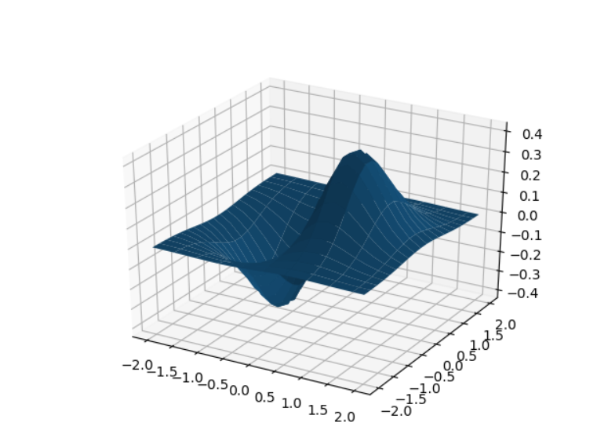

# 微積分

微積分又被稱為《分析學》，《分析學》和《代數、幾何》形成了數學的三大分支，而微積分則是最晚發展出來的一個分支。

微分是積分的反運算，這就是微積分基本定理所闡述的內容：

```math
\frac{d \int_0^t f(t) dt}{dx} = f(x)
```

就像加法與減法互為反運算，乘法與除法也互為反運算一樣！

更多的內容請參考

* [用十分鐘學會 《微積分、工程數學》及其應用 (Slide)](https://www.slideshare.net/ccckmit/ss-57088188)


## 曲線

基本曲線繪製

```py
import numpy as np
import matplotlib.pyplot as plt

x = np.linspace(0, 10, 1000)
y = np.sin(x)
z = np.cos(x)

plt.plot(x,y,label="$sin(x)$", color="red", linewidth=2)
plt.plot(x,z,label="$cos(x)$", color="blue", linewidth=1)

plt.show()
```

執行結果


多格曲線繪製


```py
import numpy as np
import matplotlib.pyplot as plt

def f(t):
    return np.exp(-t) * np.cos(2*np.pi*t)

t1 = np.arange(0.0, 5.0, 0.1)
t2 = np.arange(0.0, 5.0, 0.02)

plt.figure()
plt.subplot(211)
plt.plot(t1, f(t1), 'bo', t2, f(t2), 'k')

plt.subplot(212)
plt.plot(t2, np.cos(2*np.pi*t2), 'r--')
plt.show()
```

執行結果


## 曲面繪製

```py
import numpy as np
import matplotlib.pyplot as plt
import matplotlib.cm as cm
from mpl_toolkits.mplot3d import Axes3D

x,y = np.mgrid[-2:2:20j, -2:2:20j]
z = x*np.exp(-x**2-y**2)

ax = plt.subplot(111, projection='3d')
ax.plot_surface(x,y,z, rstride=2, cstride=1) # , cmap=plt.cm.Blues

plt.show()

```

執行結果




