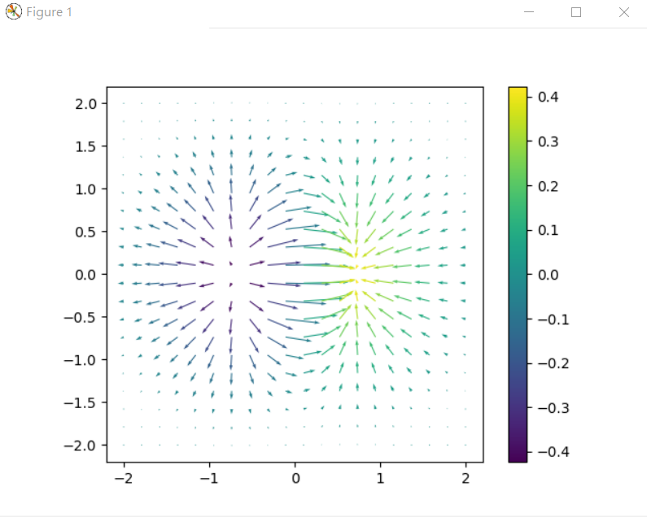

# 物理與計算

## 簡介

* [用十分鐘欣賞《物理學公理系統的演化史》(Slide)](https://www.slideshare.net/ccckmit/ss-67170427)
* [用十分鐘看懂 《近代科學發展史》(Slide)](https://www.slideshare.net/ccckmit/ss-56937501)
* [十分鐘化學史 (一) 《拉瓦錫之前的那些事兒》(Slide)](https://www.slideshare.net/ccckmit/ss-68954890)
* [用十分鐘瞭解 《電的歷史》(Slide)](https://www.slideshare.net/ccckmit/ss-57170964)
* [用十分鐘瞭解《線性代數、向量微積分》以及電磁學理論](https://www.slideshare.net/ccckmit/ss-57144026)
* [用十分鐘瞭解早期的科學史 (從埃及到文藝復興)](https://www.slideshare.net/ccckmit/ss-62503377)

## 程式範例

向量場

```
import numpy as np
import matplotlib.pyplot as plt

def f(x,y):
	return x*np.exp(-x**2-y**2)

def vec_field(f, x, y, dx=1e-6, dy=1e-6):
	fxy = f(x,y)
	vx = (f(x+dx, y) - fxy)/dx
	vy = (f(x, y+dy) - fxy)/dy
	return vx,vy

X, Y = np.mgrid[-2:2:20j, -2:2:20j]
C = f(X,Y)
U,V = vec_field(f,X,Y)
plt.quiver(X,Y,U,V,C)
plt.colorbar()
plt.gca().set_aspect("equal")

plt.show()
```

執行結果



能量位階

```py
import matplotlib
import numpy as np
import matplotlib.cm as cm
import matplotlib.pyplot as plt


delta = 0.025
x = np.arange(-3.0, 3.0, delta)
y = np.arange(-2.0, 2.0, delta)
X, Y = np.meshgrid(x, y)
Z1 = np.exp(-X**2 - Y**2)
Z2 = np.exp(-(X - 1)**2 - (Y - 1)**2)
Z = (Z1 - Z2) * 2

fig, ax = plt.subplots()
CS = ax.contour(X, Y, Z)
ax.clabel(CS, inline=1, fontsize=10)
ax.set_title('Simplest default with labels')

plt.show()
```

執行結果


## 理論背景

在物理學裏，研究的焦點是《力》！

數學裏我們用《向量》描述《力》，然後用《向量場》描述《力場》。

《經典物理》裏的《力場》有《引力場》與《電磁場》，而《量子物理》裏則多出了原子內的《弱作用力與強作用力》。


### 一維的力場

根據牛頓的引力公式，以微積分的符號描述一維的引力現象，可以寫成：

```math
F=m a
```

```math
F=m {dv \over dt}=m v'(t)
```

```math
F=m {d^2x \over dt^2}=mx''(t)
```

### 多維的力場

牛頓為了描述《力》而發展出來的《微積分》，在多變數的狀況下，會變成《向量微積分》(基本上就是《多變數微積分》)，在眾多數學家的持續發展之下，《向量微積分》成為計算物理學的利器。


一個《純量場》 (例如位能) 取微分成為《梯度》之後，就成為了《向量場》(例如引力) ，當然、反過來將《向量場》積分之後，就會變成《純量場》。


牛頓力學是如此，電磁學也是如此，《引力》和《靜電庫倫力》都會形成《力場》，而這些力場積分之後就形成了《引力位能》與《靜電力位能》。


《梯度》的數學定義如下：

```math
\nabla_{x} f(x) = \left[ \frac{\partial }{\partial x_1} f(x), \frac{\partial }{\partial x_2} f(x),\cdots,\frac{\partial }{\partial x_n} f(x) \right]^T=\frac{\partial }{\partial{x}} f(x)
```

若把《梯度》當成一個《巨型算子》可以寫為如下形式：

```math
\nabla_{x} = \left[ \frac{\partial }{\partial x_1}, \frac{\partial }{\partial x_2},\cdots,\frac{\partial }{\partial x_n} \right]^T=\frac{\partial }{\partial{x}}
```

這樣的數學雖然只是《基本的偏微分》，但是卻足以嚇倒很多人 (包括我在內！)。

### 梯度的計算

其實、很多數學只要回到基本定義，就一點都不可怕了！

讓我們先回頭看看梯度中的基本元素，也就是偏微分，其定義是：

```math
\frac{\partial }{\partial x_1} f(x) = \lim_{h \to 0} \frac{f(x_1, ..., x_i+h, ...., x_n)-f(x_1, ..., x_i, ...., x_n)}{h}
```

舉例而言，假如對 $`f(x,y) = x^2+y^2`$  這個函數而言，其對 x 的偏微分就是：

```math
\frac{\partial }{\partial x} f(x,y) = \lim_{h \to 0} \frac{f(x+h,y)-f(x,y)}{h}
```

而對 y 的偏微分就是：

```math
\frac{\partial }{\partial y} f(x,y) = \lim_{h \to 0} \frac{f(x,y+h)-f(x,y)}{h}
```

於是我們可以寫一個函數 df 來計算偏微分：

```py
# 函數 f 對變數 k 的偏微分: df / dk
def df(f, p, k, step=0.01):
    p1 = p.copy()
    p1[k] = p[k]+step
    return (f(p1) - f(p)) / step
```

這樣我們就可以用下列指令計算出 f(x,y) 在 (1,1) 這點的偏導數：

```py
p = [1.0, 1.0]
nn.df(f, p, 0)
```

只要我們對每個變數都取偏導數，然後形成一個向量，就能計算出《梯度》了！ 其 Python 程式如下：

```py
# 函數 f 在點 p 上的梯度
def grad(f, p, step=0.01):
    gp = p.copy()
    for k in range(len(p)):
        gp[k] = df(f, p, k, step)
    return gp
```

於是我們可以用 grad() 下列程式計算 f 在 (1,1) 這點的梯度。

```js
p = [1.0, 1.0]
print('grad(f,p) = ', nn.grad(f, p))
```

假如我們定義函數 f 為 $`f(x,y) = x^2+y^2`$ ，那麼 f 在 (1,1) 的梯度將會是 (2x, 2y) = (2,2)。


讓我們用程式實作一下，並驗證看看梯度的計算是否正確：

先定義函數 $`f(x,y) = x^2+y^2`$

```py
def f(p):
    [x,y] = p
    return x*x + y*y
```

然後呼叫我們的示範套件 nn，看看其計算結果是否正確：

```py
p = [1.0, 3.0]
print('grad(f,p) = ', nn.grad(f, p))

```

執行結果如下：

```
$ python gradTest.py

grad(f,p) =  [2.009999999999934, 6.009999999999849]
```

您可以看到《偏微分與梯度》的計算，基本上都非常接近，所以是正確的。


### 旋轉型的力場

對於《旋轉型的力》，我們一樣會用《向量場》表示，但由於《圓周運動》是描述《旋轉型力量》的關鍵，數學上我們通常用《三角函數》 sin, cos 來描述圓周運動。

但是根據以下的《尤拉公式》，我們可以將《實數空間》擴充到《複數空間》，就能更好的利用 $`e^{i \theta}`$ 來描述《旋轉型的力量》所造成的效果。

```math
e^{i \theta} = cos(\theta) + i sin(\theta)
```

透過上述的《尤拉公式》，我們可以引出《傅立葉轉換》，將《點空間》轉換到《頻率空間》，因而形成

```math
\hat{f}(\xi) = \int_{-\infty}^\infty f(x)\ e^{- 2\pi i x \xi}\,dx = \int_{-\infty}^\infty f(x)\ (cos (- 2\pi i x \xi) + i sin(- 2\pi i x \xi)) \,dx
```

在《訊號處理》領域，《傅立葉轉換》是用來描述《波函數》的利器，而這些波函數其實就是《粒子點的圓周運動》所造成的現象。

或許這就是《數學版的波粒二象性》吧！


像是《旋轉的鐵盤、齒輪》、以及《流體力學》的《液體漩渦》、還有《震盪的電荷》能產生《電磁波》、《量子力學》裏的《機率波》與《狄拉克波動方程》等等，都是可以用《複數空間》與《傅立葉轉換》處理的領域！

我很難想像，要是沒有這些數學，那麼該如何處理那些《圓周運動和波動》呢？


