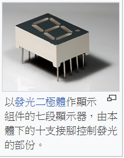

## 七段顯示器的數字識別問題

實體 | 編碼
----|------
 | 

要識別七段顯示器上的數字並不難，假如不考慮影像處理，而是直接對每個 LED 亮或不亮用二進位編碼法，那麼可以得到下列表格。


但是《七段顯示器》的所有可能樣式總共有如下圖的 $`2^7=128`$ 種，假如該樣式非標準答案，那麼該如何判斷呢？


對於完全正確的的標準顯示樣式，也就是該《顯示樣式》屬於 0,1,2,3,4,5,6,7,8,9 ，那麼直接透過查表就可以回答：

```
   A B C D E F G
0  1 1 1 1 1 1 0
1  0 1 1 0 0 0 0
2  1 1 0 1 1 0 1
3  1 1 1 1 0 0 1
4  0 1 1 0 0 1 1
5  1 0 1 1 0 1 1
6  1 0 1 1 1 1 1
7  1 1 1 0 0 1 0
8  1 1 1 1 1 1 1
9  1 1 1 1 0 1 1
```

但是、假如某個《顯示樣式》並不屬於 0,1,2,3,4,5,6,7,8,9 ，那麼應該如何識別呢？

例如下圖的 x = (0 0 1 1 1 1 1) 應該識別為甚麼數字呢？


我們可以透過二進位距離 d(x,i) 的衡量，得到下列結果：

```
x  0 0 1 1 1 1 1  

   A B C D E F G  d(x,i)
0  1 1 1 1 1 1 0  3
1  0 1 1 0 0 0 0  5
2  1 1 0 1 1 0 1  4
3  1 1 1 1 0 0 1  4
4  0 1 1 0 0 1 1  3
5  1 0 1 1 0 1 1  2
6  1 0 1 1 1 1 1  1
7  1 1 1 0 0 1 0  5
8  1 1 1 1 1 1 1  2
9  1 1 1 1 0 1 1  3
```

於是我們取距離最近的數字 6 作為答案，將該數字辨識為 6.

上述的方法其實就是《以最近鄰居的答案為答案》，也就是 KNN《K-近鄰》方法取 K = 1 時的做法。

